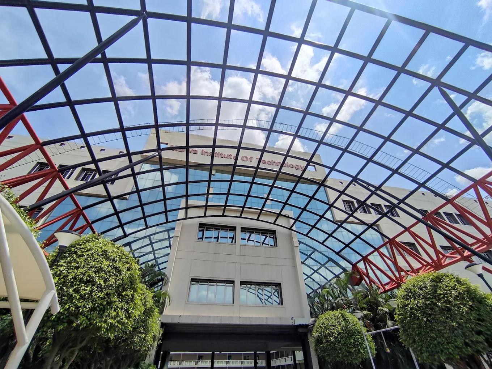

# Malwa Institute of Technology (MIT) Indore — Official Website



A premium, modern, and fully responsive redesign of the official website for **Malwa Institute of Technology (MIT), Indore**. Built with a focus on performance, aesthetics, and user experience to represent one of Central India's premier engineering institutions.

## 🚀 Recent Updates (April 2026)
- **Home Page Restructuring**: Simplified navigation by integrating the full **About Us** section onto the Home page and replacing the extensive department grid with a high-impact single CTA.
- **Career Portal**: Integrated a new "Join Our Team" application portal for prospective faculty and staff with a dedicated attractive UI.
- **Enhanced Mobile UI**: Optimized the mobile navigation menu with an accordion-style department list and immersive full-bleed video players.

---

## ✨ Key Features

- **💎 Premium Design System**: Custom Dark Navy & Crimson color palette with glassmorphism, smooth micro-animations, and high-fidelity typography.
- **📱 Mobile-First Optimization**: Edge-to-edge responsive design with a custom touch-friendly navigation system and gesture-ready components.
- **🏫 Dynamic Department Engine**: Auto-generating routes and profile pages for all engineering branches (CS, IT, ME, EC, Civil) via centralized data management.
- **📝 Admissions Hub**: Integrated Zoho enrollment forms and real-time admission chat support to streamline student acquisition.
- **🛡️ Statutory Compliance**: Dedicated sections for Anti-Ragging, Internal Quality Assurance (IQAC), and mandatory disclosures.

---

## 🛠️ Tech Stack

- **Framework**: [React 18](https://reactjs.org/) (Functional Components, Hooks)
- **Build Tool**: [Vite](https://vitejs.dev/) for ultra-fast HMR and optimized builds.
- **Icons**: [Lucide React](https://lucide.dev/) for a consistent, lightweight iconography.
- **Routing**: [React Router Dom v6](https://reactrouter.com/) using `HashRouter` for zero-config shared hosting.
- **Styling**: Modern Vanilla CSS with CSS Variables (Design Tokens) and utility patterns.

---

## 📂 Project Structure

```bash
src/
├── assets/         # Optimized images (WebP), logos, and branding assets
├── components/     # Reusable UI components (Navbar, Hero, About, VideoPlayer)
├── data/           # Centralized data store (departmentsData.jsx)
├── pages/          # Individual route components (Home, Academics, Admissions)
├── App.jsx         # Global routing and layout structure
└── index.css       # Core design system, variables, and global styles
```

---

## 📦 Production & Deployment

The project is optimized for shared hosting (GoDaddy, Bluehost, etc.).

1.  **Generate Build**:
    ```bash
    npm run build
    ```
2.  **Upload to Server**:
    *   Locate the `dist/` directory.
    *   Upload all contents of `dist/` to your server's root (e.g., `public_html`).
    *   *Note: HashRouter ensures that refreshes work correctly without `.htaccess` changes.*

---

## 📄 Maintenance Documentation

Detailed technical guides can be found in the [docs/](docs/DEVELOPMENT.md) folder:
- [Design System & Variables](docs/DEVELOPMENT.md#2-design-system-css-architecture)
- [How to Update Academic Calendars](docs/DEVELOPMENT.md#3-dynamic-content-management)
- [Adding New Departments](docs/DEVELOPMENT.md#3-dynamic-content-management)

---

## 🤝 Contact
**Harshraj Thakur**  
[GitHub Profile](https://github.com/TheHarshrajThakur)

---
*Developed with ❤️ for Malwa Institute of Technology.*
